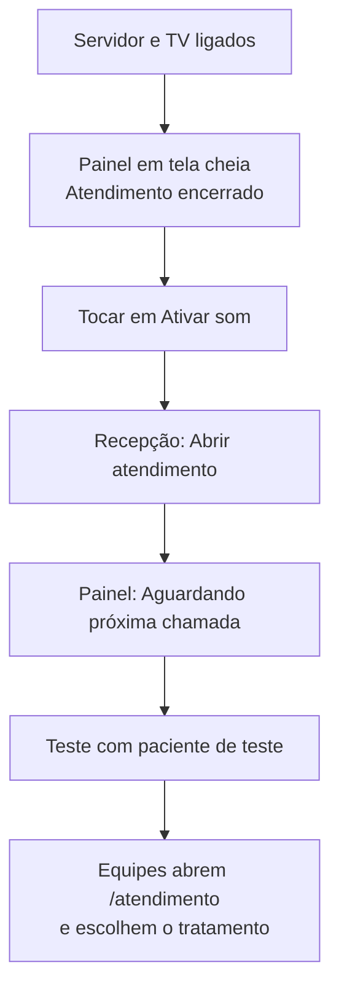
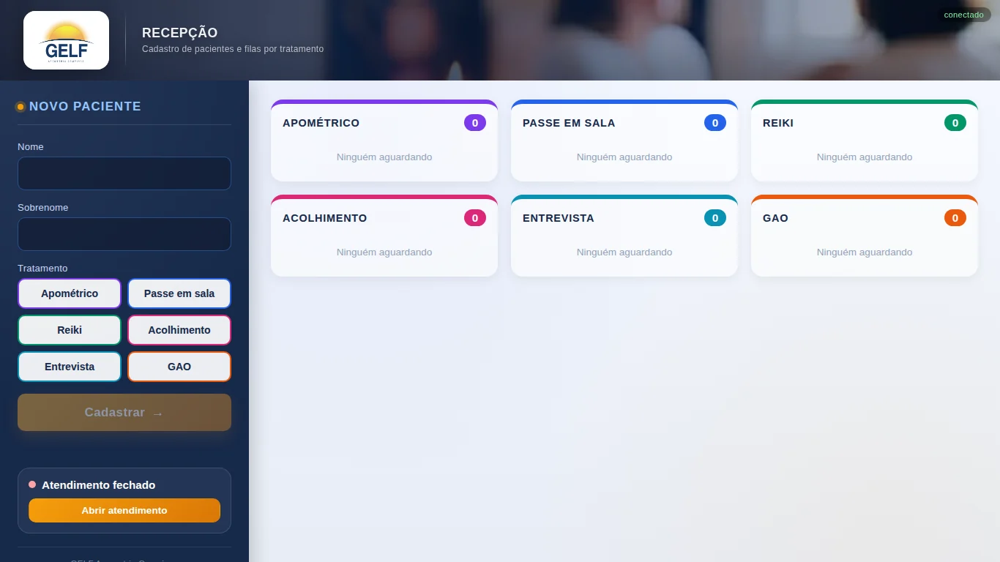
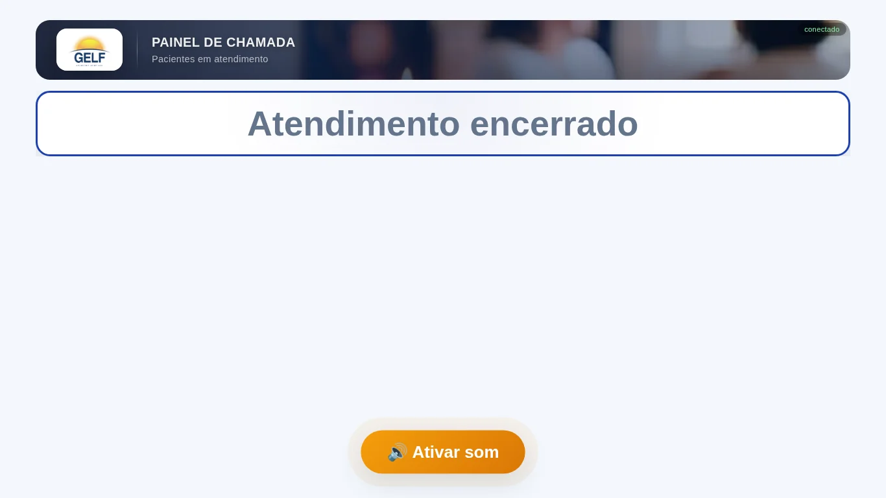
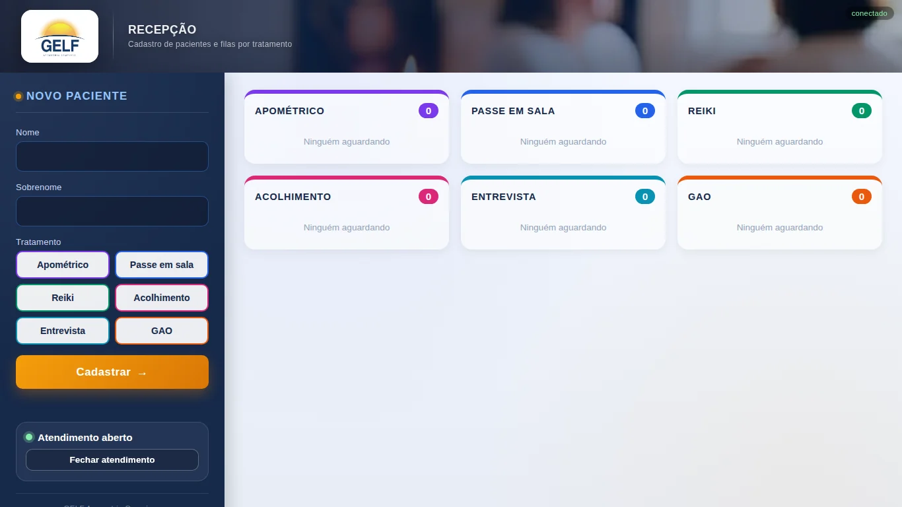
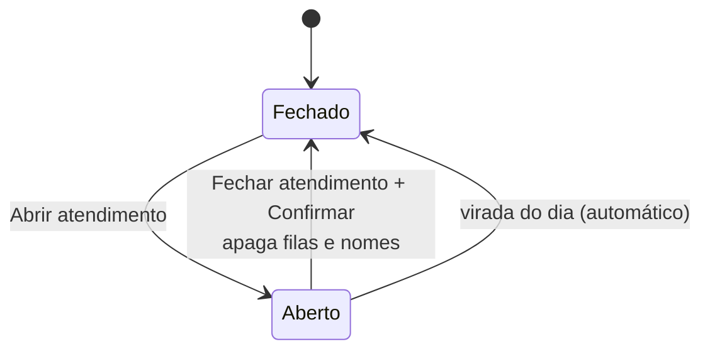

# Fluxo 1 — Abertura do dia

Quem faz: a pessoa da **recepção**, com a TV ligada. Leva cerca de 5 minutos, antes do primeiro paciente.
Complementa o [checklist de abertura](../guias/checklist-abertura.md).

## Visão geral

## Passo a passo

### 1. Recepção ainda com o atendimento fechado
Endereço: `/recepcao`. Com o atendimento fechado, **ninguém consegue cadastrar nem chamar**: o botão
**Cadastrar** fica desativado e o indicador à esquerda mostra **Atendimento fechado**.

### 2. Painel da TV antes de abrir
Endereço: `/painel`, em tela cheia (F11). Mostra **Atendimento encerrado** e o botão **Ativar som**.
O navegador só libera o áudio depois de um toque, então toque nele uma vez: a TV toca um sinal de teste e
o botão some. O indicador **conectado** (canto superior direito) confirma a ligação com o servidor.

### 3. Abrir o atendimento
Na recepção, toque em **Abrir atendimento** (canto esquerdo, embaixo). O indicador passa a
**Atendimento aberto**, o botão **Cadastrar** é liberado e as seis filas aparecem vazias. Na TV, o aviso muda
para **Aguardando próxima chamada** (ver [Fluxo 4 — Painel](4-painel.md)).

### 4. Teste rápido
1. Cadastre "Teste Teste" (ver [Fluxo 2 — Recepção](2-recepcao.md)).
2. No celular, chame o paciente (ver [Fluxo 3 — Atendimento](3-atendimento.md)).
3. Confira **nome, sala e som** na TV.
4. Toque em **Iniciar** e **Concluir**, ou remova o paciente com ✕ antes de chamar.

### 5. Equipes
Cada equipe abre `/atendimento` no celular e escolhe o seu tratamento. O aparelho lembra a escolha.

## Transições do estado do dia

| Estado | Recepção | Atendimento | Painel da TV |
|---|---|---|---|
| Fechado | cadastro desativado | chamar desativado | Atendimento encerrado |
| Aberto | cadastro liberado | chamar liberado | Aguardando próxima chamada, depois as chamadas |

## Se algo falhar
Veja a tabela do [checklist de abertura](../guias/checklist-abertura.md#se-algo-falhar): sem conexão, sem som,
celular que não abre a página e notebook reiniciado.

Próximo: [Fluxo 2 — Recepção](2-recepcao.md)
