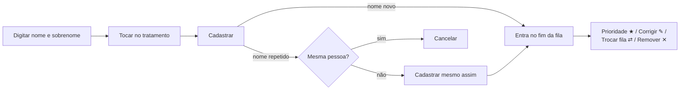
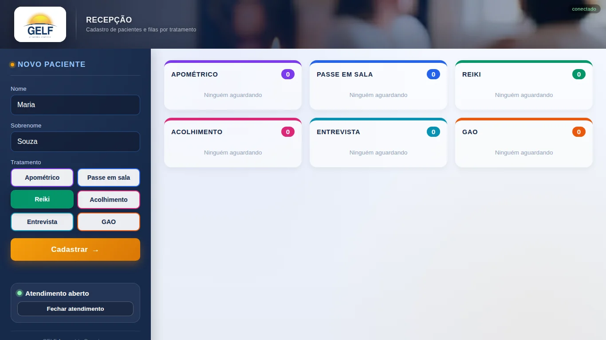
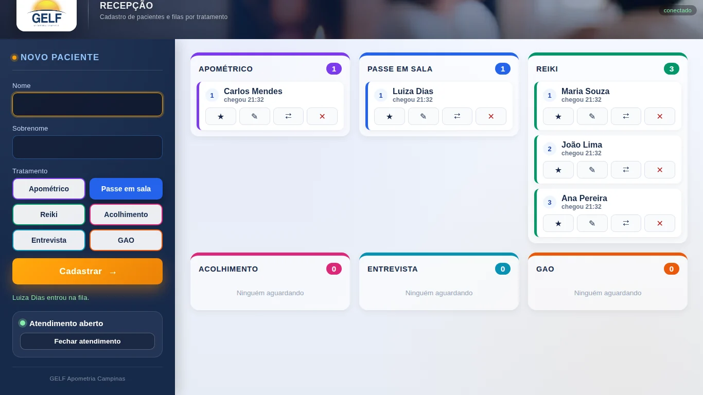
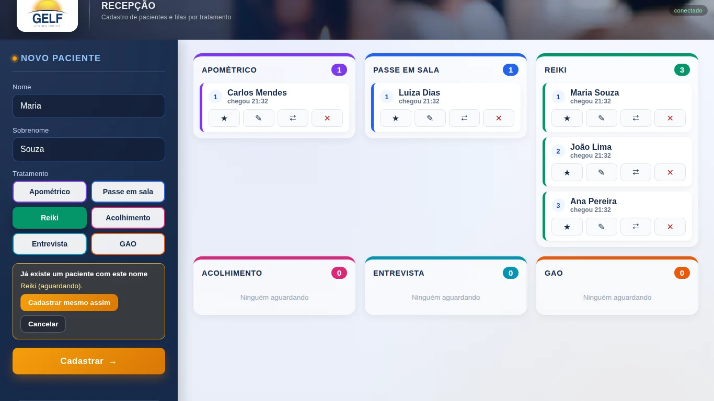
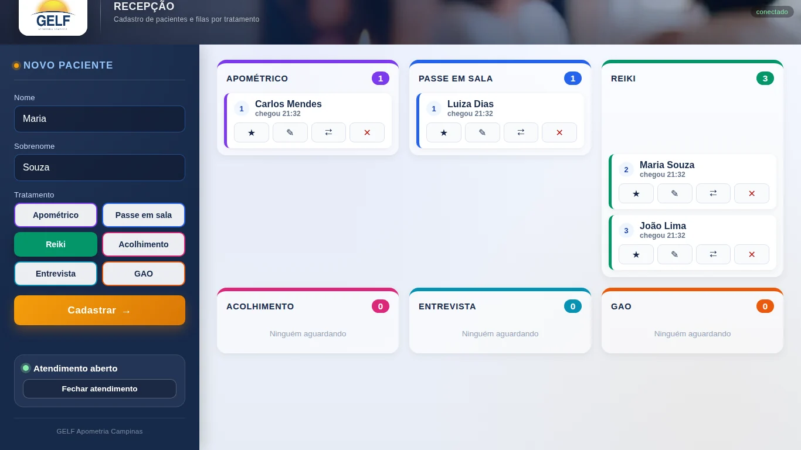
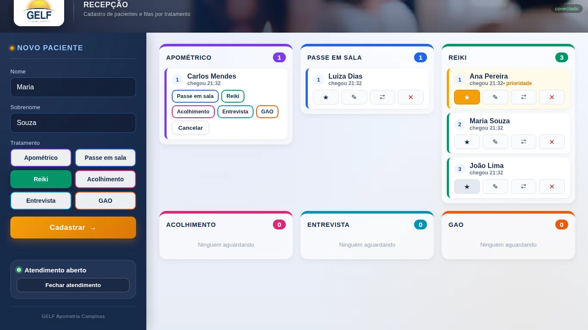
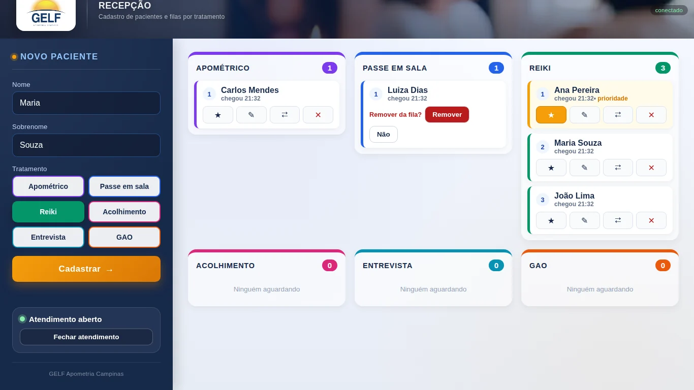
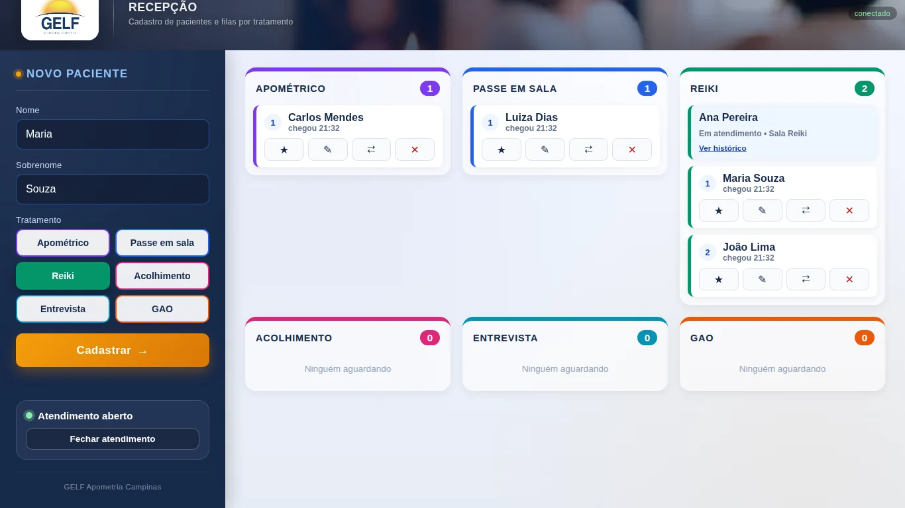
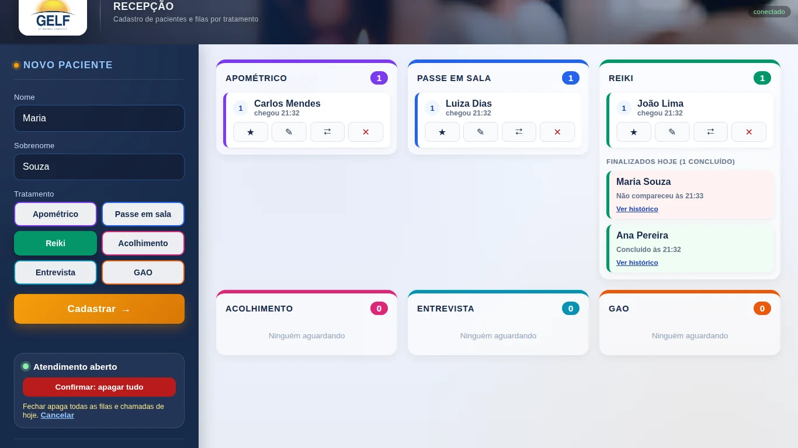
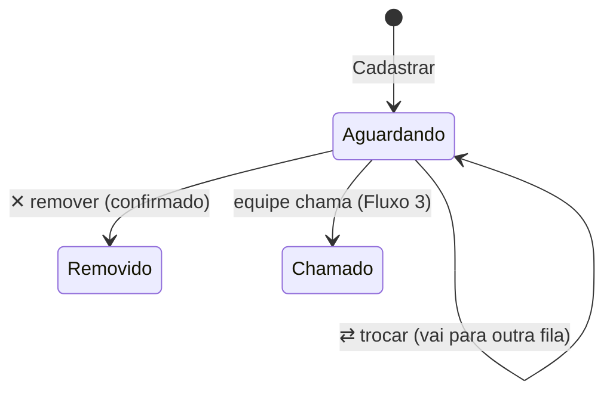

# Fluxo 2 — Recepção

Quem faz: a **recepção**. Endereço: `/recepcao`. Resumo para consulta rápida no [guia da recepção](../guias/recepcao.md).

## Visão geral

## Passo a passo

### 1. Cadastrar um paciente
Digite **nome** e **sobrenome** e toque no **tratamento** (o botão escolhido fica preenchido).

Toque em **Cadastrar** (ou Enter). O paciente entra no **fim** da fila do tratamento, aparece a confirmação
("… entrou na fila.") e o cursor volta ao campo nome, pronto para o próximo.

Cada cartão mostra a posição, o nome, a hora de chegada e quatro botões: ★ ✎ ⇄ ✕.

### 2. Nome repetido
Se já existe um paciente com o mesmo nome (o sistema ignora acentos e maiúsculas), aparece o aviso
**"Já existe um paciente com este nome"**, dizendo em que fila ele está.

| Botão | O que acontece |
|---|---|
| **Cadastrar mesmo assim** | é outra pessoa: cadastra normalmente |
| **Cancelar** | é a mesma pessoa: não cadastra |

### 3. Prioridade ★
Toque em ★ no cartão (idosos, gestantes, pessoas com deficiência). O paciente **sobe para o início da fila**,
o cartão fica destacado e aparece o selo **prioridade**. Se houver mais de um prioritário, vale a ordem em que
foram marcados. Toque de novo em ★ para tirar.

### 4. Trocar de fila ⇄
Toque em ⇄ e depois no tratamento de destino. O paciente vai para o **fim** da fila nova.
**Cancelar** desfaz.

### 5. Corrigir ✎
Abre os campos de nome e sobrenome do cartão. **Salvar** grava a correção; **Cancelar** descarta.

### 6. Remover ✕
Pede confirmação no próprio cartão (**Remover** / **Não**). Use para desistência ou cadastro errado.

### 7. Acompanhar o atendimento
Quando uma equipe chama o paciente, ele sai da fila de espera e o cartão passa a mostrar a situação e a sala
(ex.: "Em atendimento • Sala Reiki"). Ao final, ele vai para **Finalizados hoje** do tratamento, com a
contagem de concluídos: em verde quem **concluiu** e em vermelho quem **não compareceu**.

> Paciente com **dois tratamentos** no dia: quando ele concluir o primeiro, cadastre-o de novo na fila seguinte.

### 8. Fechar o atendimento (fim do dia)
Toque em **Fechar atendimento**. O botão vira **Confirmar: apagar tudo**, porque fechar **apaga todas as filas e
chamadas do dia** na hora; **Cancelar** desfaz. Se esquecer, o sistema apaga sozinho na virada do dia.

## Transições de um paciente na recepção

Anterior: [Fluxo 1 — Abertura](1-abertura.md) · Próximo: [Fluxo 3 — Atendimento](3-atendimento.md)
