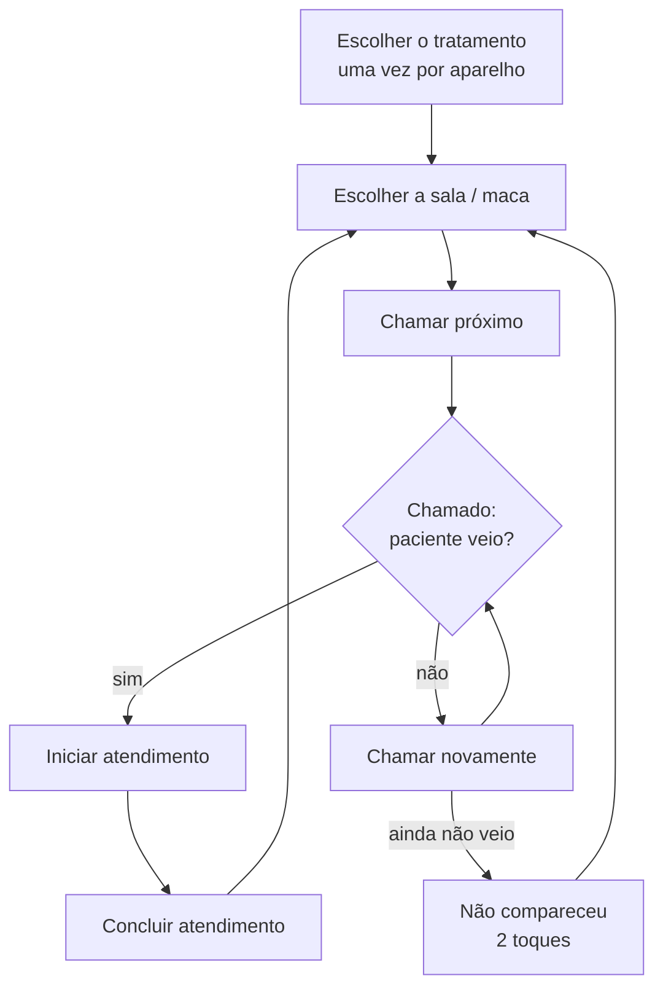
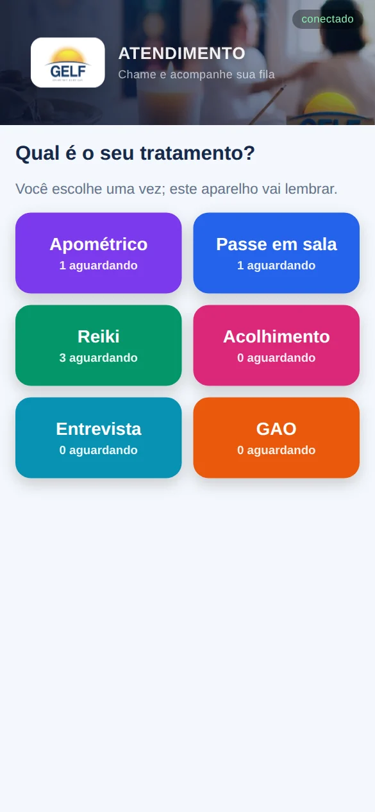
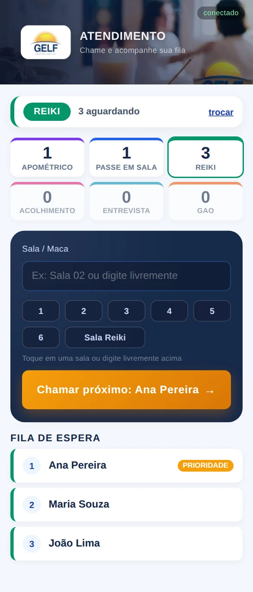
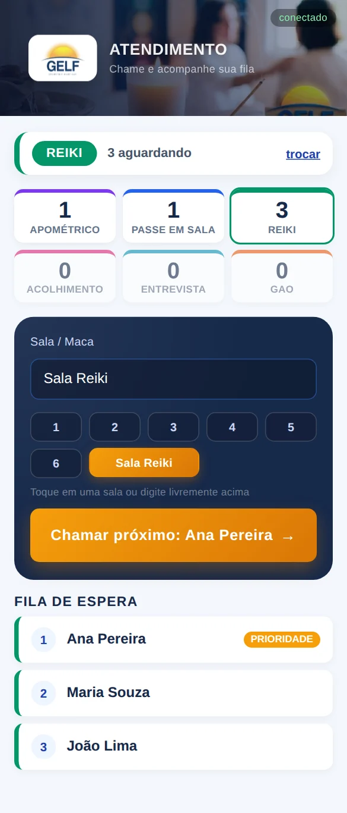
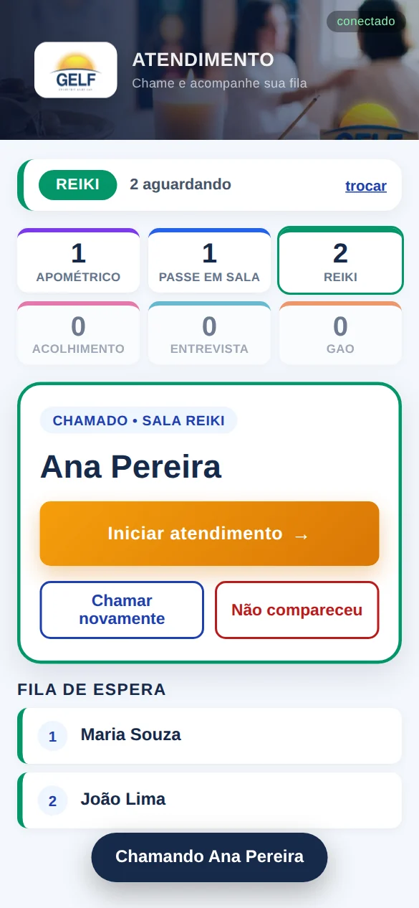
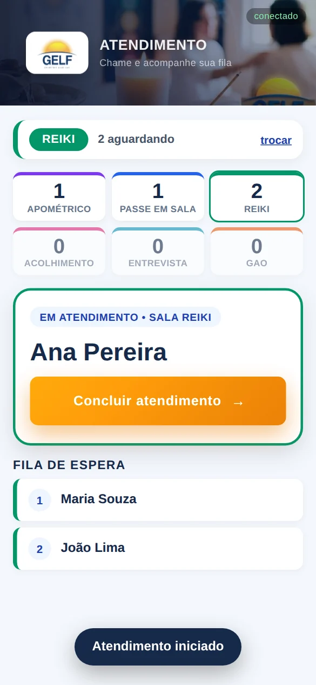
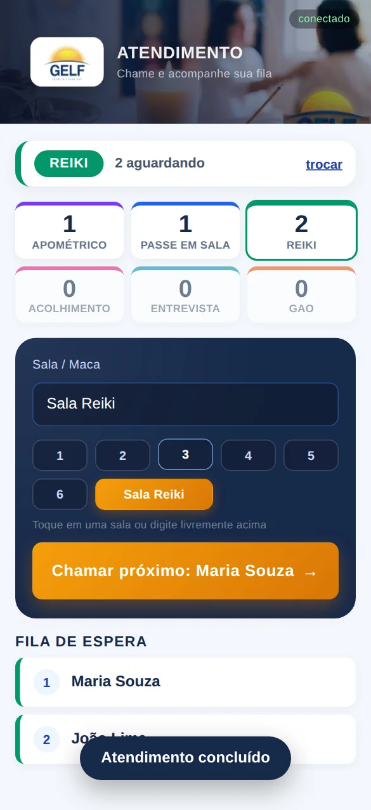
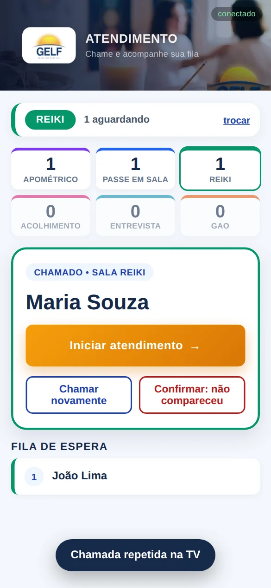
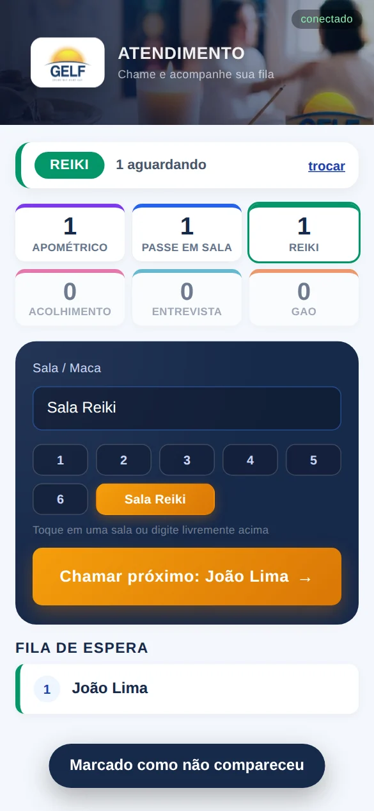
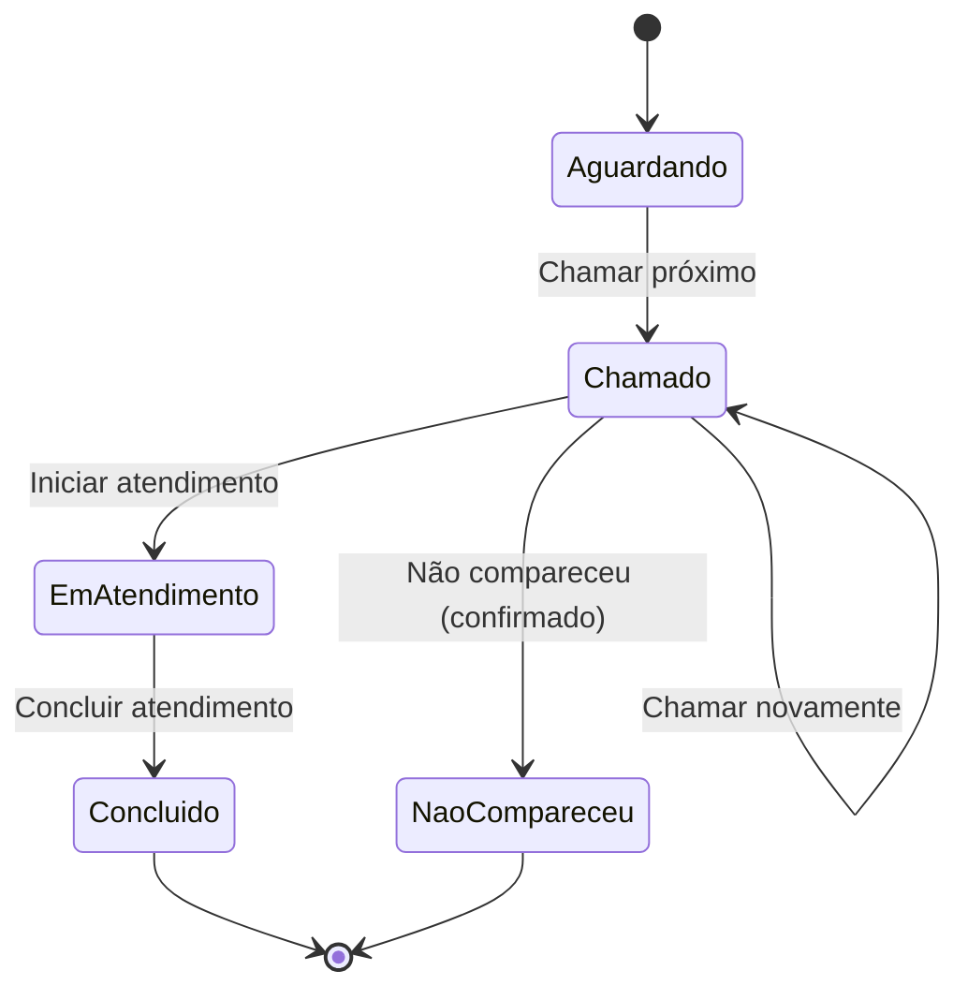

# Fluxo 3 — Atendimento (equipes, no celular)

Quem faz: **cada equipe de tratamento**, no próprio celular ou tablet. Endereço: `/atendimento`
(ex.: http://painel-gelf.local:3000/atendimento). Resumo no [guia das equipes](../guias/atendimento.md).

## Visão geral

Cada aparelho atende **um paciente por vez**: só depois de concluir (ou marcar "não compareceu") dá para chamar outro.

## Passo a passo

### 1. Escolher o tratamento
Na primeira vez, toque no **seu tratamento**. Cada botão mostra quantos pacientes aguardam. O aparelho
lembra a escolha; para mudar, toque em **trocar** no topo.

### 2. Escolher a sala e chamar
O topo mostra o seu tratamento, quantos aguardam e o resumo de todas as filas (a sua fica destacada).
No cartão escuro, informe a **Sala / Maca**: toque no número (1 a 6) ou em **Sala Reiki**, ou digite
livremente (ex.: "Sala 02"). O botão laranja mostra quem será chamado: **Chamar próximo: nome**.

### 3. Paciente chamado
Ao tocar em **Chamar próximo**, a TV mostra nome, sala e toca o sinal ([Fluxo 4 — Painel](4-painel.md)).
O celular passa a mostrar o paciente com a situação **Chamado • sala** e três opções:

| Botão | O que faz |
|---|---|
| **Iniciar atendimento** | o paciente chegou à sala |
| **Chamar novamente** | repete aviso e som na TV ("Chamada repetida na TV") |
| **Não compareceu** | encerra a chamada; pede um segundo toque para confirmar |

### 4. Em atendimento
Depois de **Iniciar**, resta um botão: **Concluir atendimento**. A TV passa a mostrar **Em atendimento**
e a recepção vê o paciente na sala.

### 5. Concluir
**Concluir atendimento** libera o aparelho: a tela volta ao cartão de sala, com o aviso
"Atendimento concluído", pronta para chamar o próximo. O paciente vai para **Finalizados hoje** na recepção.

### 6. Paciente que não aparece
1. **Chamar novamente** (quantas vezes precisar).
2. Se ainda não vier, toque em **Não compareceu**. O botão muda para **Confirmar: não compareceu**:
   toque de novo para confirmar (evita toque acidental).

3. O aviso "Marcado como não compareceu" aparece, o paciente vai para **Finalizados hoje** (em vermelho) e a
   tela já oferece o próximo da fila.

## Transições de um paciente

| Situação | Celular da equipe | Painel da TV | Recepção |
|---|---|---|---|
| Aguardando | na fila de espera | não aparece | na fila, com ★ ✎ ⇄ ✕ |
| Chamado | Iniciar / Chamar novamente / Não compareceu | nome, sala, **Chamado** + som | cartão com a sala |
| Em atendimento | Concluir atendimento | **Em atendimento** | "Em atendimento • sala" |
| Concluído | pronto para o próximo | **Atendimento concluído** | Finalizados hoje (verde) |
| Não compareceu | pronto para o próximo | sai do destaque | Finalizados hoje (vermelho) |

## Dicas
- A fila mostra a ordem real: quem tem selo **Prioridade** já está na frente.
- Se o aviso ficar vermelho ou a fila não atualizar, veja o indicador **conectado / sem conexão** no topo.

Anterior: [Fluxo 2 — Recepção](2-recepcao.md) · Próximo: [Fluxo 4 — Painel](4-painel.md)
