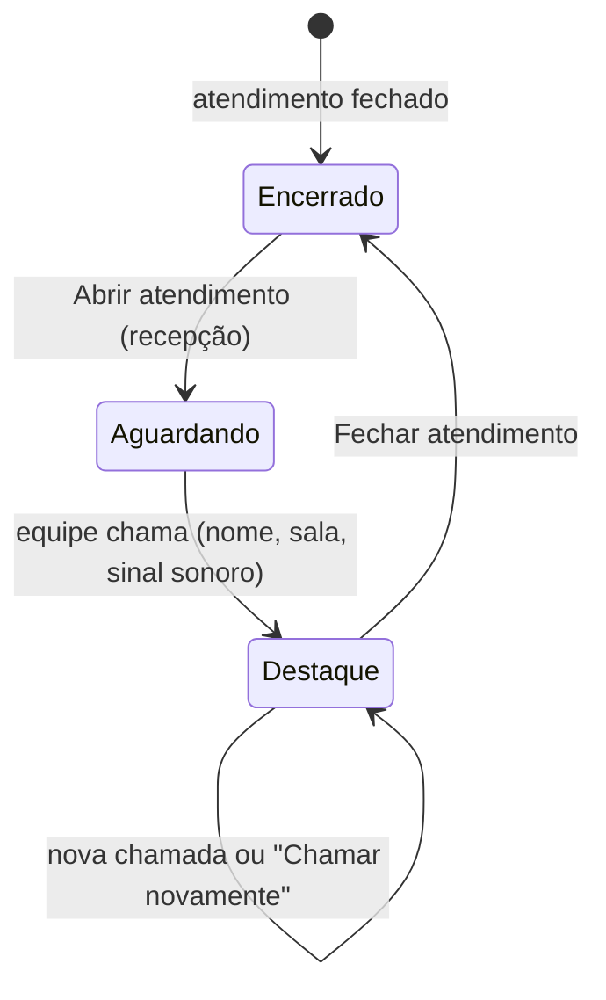
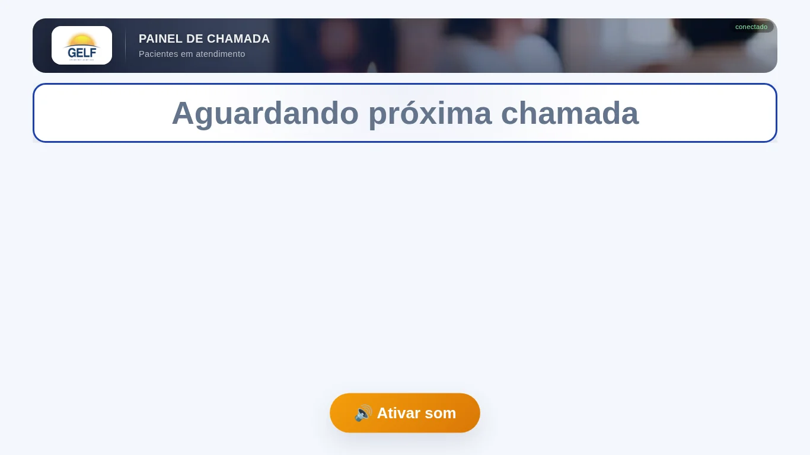
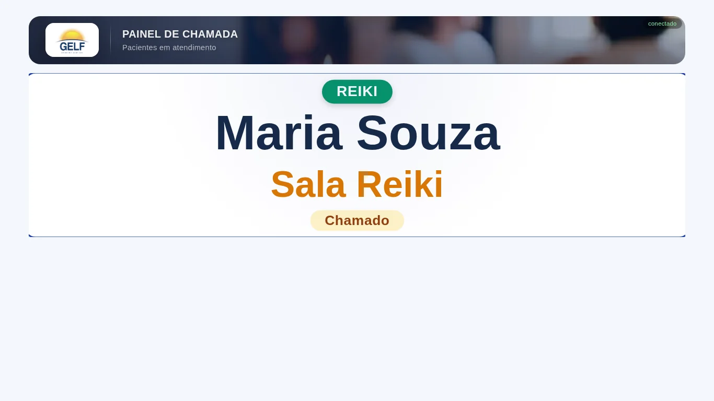
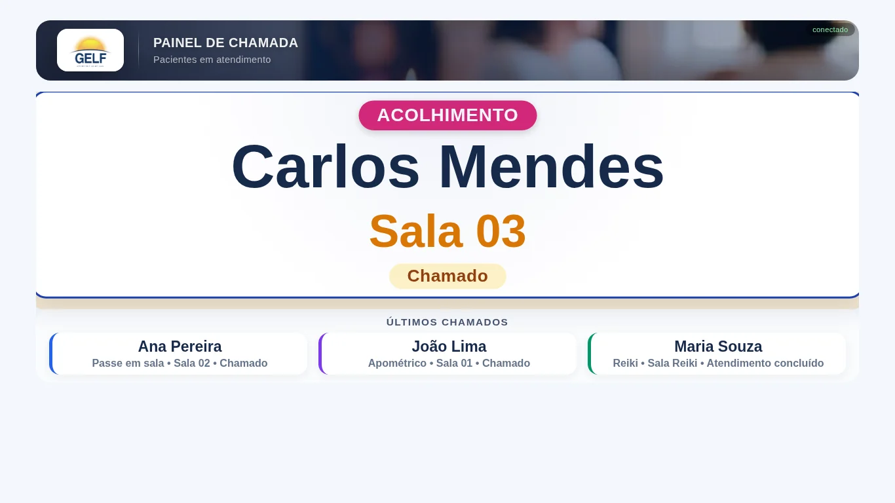
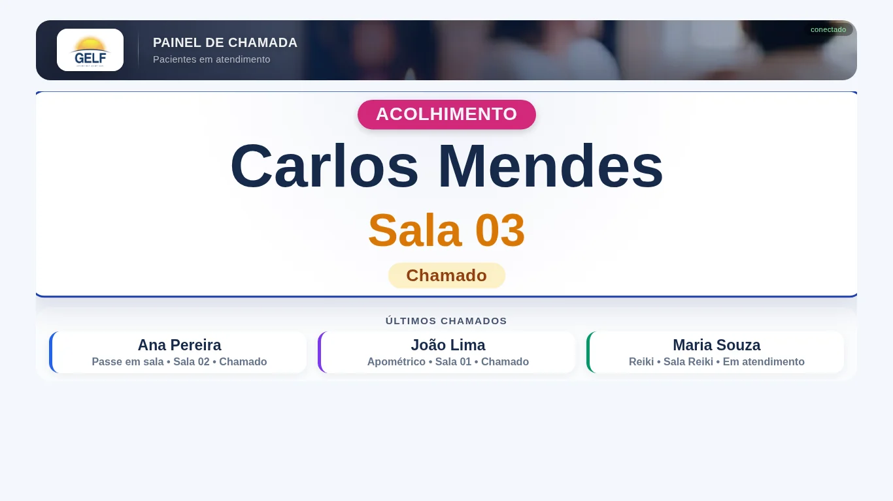

# Fluxo 4 — Painel da TV

Quem vê: **os pacientes**, na sala de espera. Ninguém opera o painel: ele só **reflete** o que a recepção e as
equipes fazem. Endereço: `/painel`, no notebook ligado à TV, com Chrome em tela cheia (F11), zoom 100%.

## Visão geral

## Estados da tela

### 1. Atendimento encerrado
Aparece antes da abertura e depois do fechamento. Se o som ainda não foi liberado, o botão **Ativar som**
fica visível (um toque libera o áudio e toca um sinal de teste).

### 2. Aguardando próxima chamada
O atendimento está aberto e ninguém foi chamado ainda.

### 3. Chamada em destaque
Quando uma equipe toca em **Chamar próximo** (ou **Chamar novamente**), a TV mostra, em letras grandes:

- o **tratamento** (na cor dele),
- o **nome e sobrenome** do paciente (até duas linhas, sem rolagem),
- a **sala** (laranja),
- a **situação**: **Chamado**.

E toca o sinal sonoro: duas vezes, com intervalo de 4 segundos (padrão em `config/configuracao.json`).
O destaque fica pulsando por alguns segundos (`destaqueMs`, padrão 15 s).

Se duas equipes chamam ao mesmo tempo, as chamadas entram **uma após a outra**, sem que o som de uma
corte o da outra.

### 4. A situação muda sem tocar som
Quando a equipe toca em **Iniciar atendimento**, o rótulo muda para **Em atendimento**; ao concluir, para
**Atendimento concluído**. Só a chamada toca o sinal.

### 5. Últimos chamados
Abaixo do destaque, a lista mostra as chamadas anteriores (padrão: 4), cada uma com **tratamento • sala • situação**.
Quem acabou de ser chamado fica no destaque; os demais descem para a lista.

## O que aparece e o que sai da TV

| Evento | Efeito na TV |
|---|---|
| Chamar próximo | vira o destaque, com som |
| Chamar novamente | o paciente volta ao destaque, com som (sem duplicar na lista) |
| Iniciar / Concluir | o rótulo da situação muda, sem som |
| **Não compareceu** | o paciente **sai** da TV |
| Fechar atendimento | **Atendimento encerrado** |
| Servidor fora do ar | indicador **sem conexão**; a TV reconecta sozinha |

## Ajustes
Em `config/configuracao.json` (valem ao reiniciar o servidor): repetições, intervalo e volume do som;
tempo de destaque; exibir sobrenome completo; quantidade de chamadas anteriores.

## Conferência na TV Samsung 32"
A tela usa só unidades relativas (vh/vw) e margem de segurança de 4%, porque TVs dessa geração cortam as bordas
(overscan). Na TV, use **Ajuste à tela / 16:9** (ou renomeie a entrada HDMI para "PC"/"DVI PC") e faça uma
chamada de teste para conferir que nada é cortado.

Anterior: [Fluxo 3 — Atendimento](3-atendimento.md) · Próximo: [Fluxo 5 — Cura Mediúnica (Bio)](5-bio.md)
