# Fluxo 5 — Cura Mediúnica / Bioenergético (`/bio`)

Tratamento em que o paciente percorre uma **rota de etapas**, em vez de uma fila única. É independente das
filas dos fluxos 1 a 4: tem telas, estado e arquivo diário próprios.

| Tela | Endereço | Quem usa |
|---|---|---|
| Controle | `/bio/controle` | O responsável pelo fluxo: abre o dia, registra chegadas, chama, acompanha e fecha o dia |
| Painel da TV | `/bio/painel` | As duas TVs (térreo e 1º andar), com a mesma tela |

Resumo para consulta rápida no [guia da Cura Mediúnica](../guias/bio.md).

## A rota e as salas

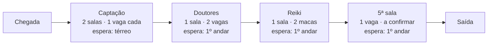
```mermaid
flowchart LR
    A[Chegada] --> B[Captação<br/>2 salas · 1 vaga cada<br/>espera: térreo]
    B --> C[Doutores<br/>1 sala · 2 vagas<br/>espera: 1º andar]
    C --> D[Reiki<br/>1 sala · 2 macas<br/>espera: 1º andar]
    D --> E[5ª sala<br/>1 vaga · a confirmar<br/>espera: 1º andar]
    E --> F[Saída]
```

Etapas, salas, capacidades e locais de espera ficam em `config/bio.json` (a 5ª sala ainda é "a confirmar").
Para mudar o fluxo, edite o arquivo e reinicie o servidor; no dia a dia, vagas e salas se ajustam na própria tela.

## Passo a passo no controle

### 1. Abertura dos trabalhos
Com o dia fechado, o controle mostra a **Abertura dos trabalhos**:

- marque as **salas que funcionam hoje** e a **capacidade** de cada uma (ex.: número de macas do reiki);
- se houver lista de pré-inscritos, cole **uma pessoa por linha**: `Nome Sobrenome ; dia ; descrição`;
- o **relatório do último dia fechado** aparece embaixo, como referência.

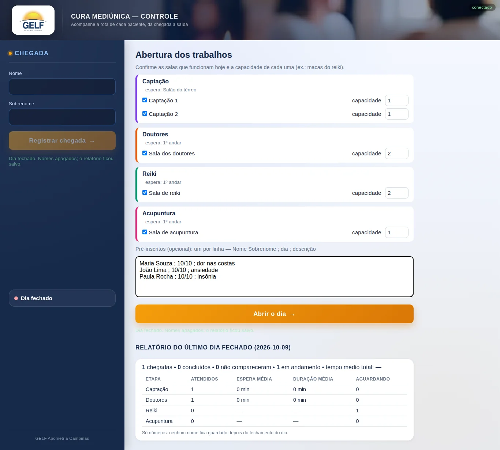

Toque em **Abrir o dia**. O indicador passa a **Dia aberto** e as colunas de cada etapa aparecem.
Na TV, o painel muda de **Atendimento encerrado** para **Aguardando próxima chamada**.

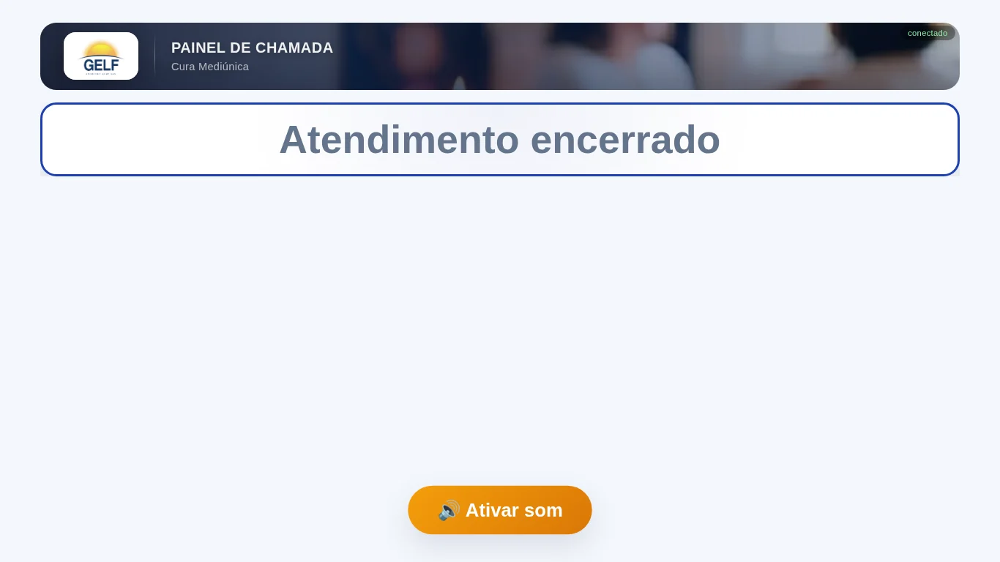

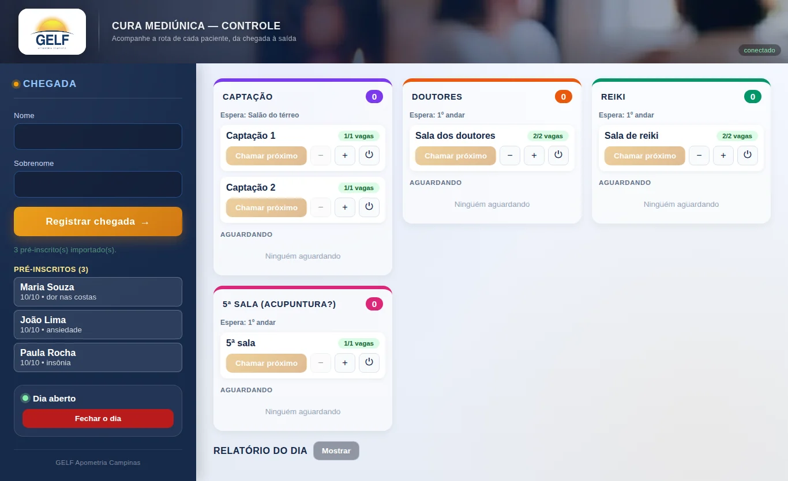

### 2. Registrar a chegada
Duas formas, ambas colocam o paciente no **fim da espera da primeira etapa** (Captação):

- digitar **nome** e **sobrenome** e tocar em **Registrar chegada**;
- tocar no nome na lista **Pré-inscritos** (o paciente leva a descrição junto, ex.: "dor nas costas").

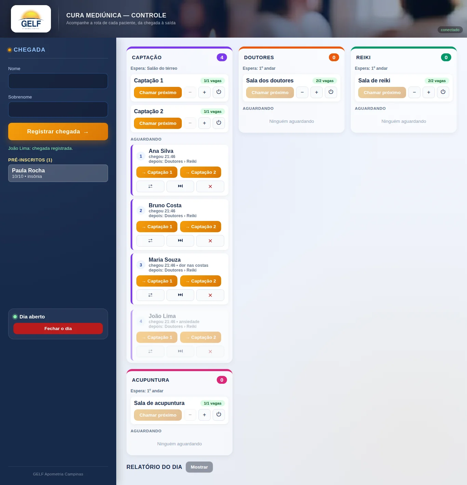

Se o nome já existe no fluxo, aparece **"Já existe um paciente com este nome no fluxo"**, com a situação dele.
**Registrar mesmo assim** (é outra pessoa) ou **Cancelar** (limpa os campos).

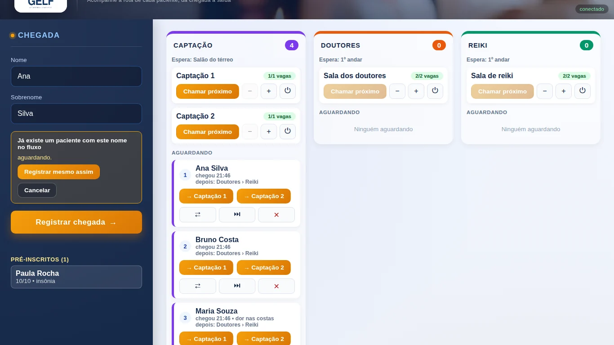

### 3. Chamar para uma sala
Cada coluna tem as suas salas, com as vagas (ex.: `1/1 vagas`) e a lista **Aguardando**. Duas formas de chamar:

| Forma | Quando usar |
|---|---|
| **Chamar próximo** (na sala) | chama o primeiro da espera da etapa |
| **→ nome da sala** (no cartão do paciente) | os doutores escolhem **quem** entra |

Só chama se a sala tem vaga: sem vaga, o botão fica desativado. A chamada aparece na TV com som.

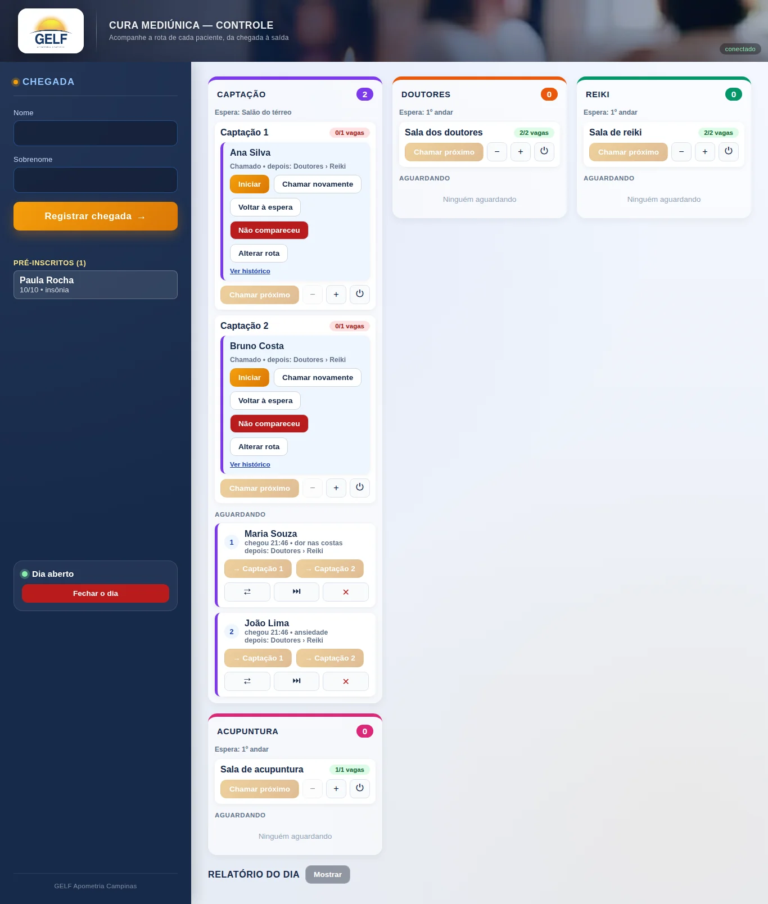

### 4. Acompanhar o paciente
Paciente **Chamado** (a caminho):

| Botão | O que faz |
|---|---|
| **Iniciar** | chegou à sala |
| **Chamar novamente** | repete aviso e som na TV |
| **Voltar à espera** | devolve ao fim da fila da mesma etapa |
| **Não compareceu** | encerra o paciente (veja o item 7) |

Paciente **Em atendimento**: **Concluir etapa** libera a vaga e leva o paciente à espera da **próxima etapa da rota**
(o cartão mostra "depois: Doutores › Reiki › …").

A TV acompanha, sem som, com o rótulo: **Chamado** → **Em atendimento** → **Etapa concluída — aguarde**
(quando ele já saiu da sala e espera a próxima) → **Atendimento concluído** (fim da rota).

### 5. Preparo da sala de captação
Ao concluir a etapa na **Captação**, a sala **não** volta a ter vaga na hora: aparece **Em preparo (1)** e a
vaga fica em `0/1` (fechamento das energias). Só depois de tocar em **Sala pronta** a vaga é liberada.

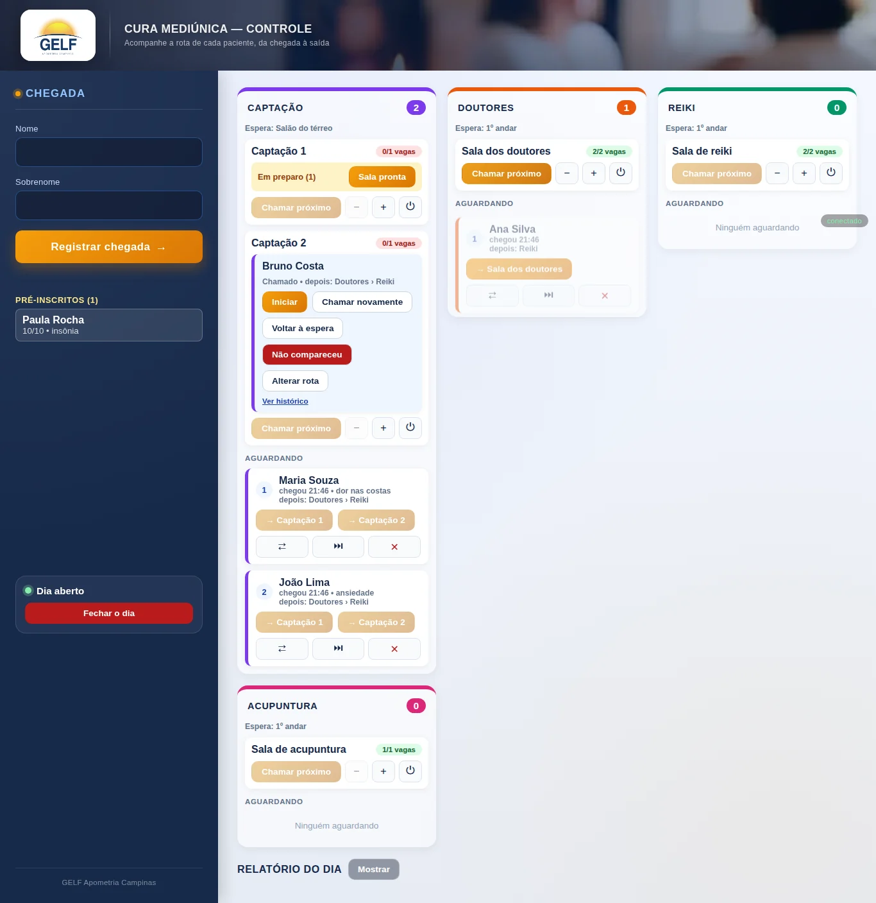

### 6. Histórico e rota por paciente
**Ver histórico** (no cartão) lista cada movimento com a hora: chegou, entrou na espera, chamado, atendimento
iniciado, etapa concluída…

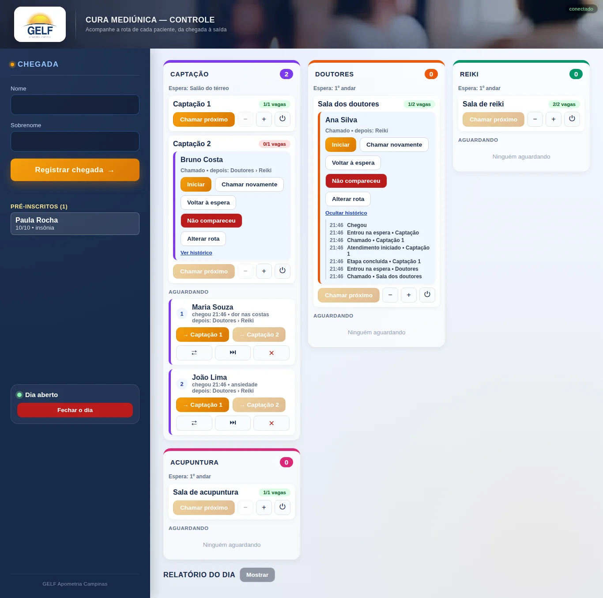

No cartão de quem aguarda:

| Botão | O que faz |
|---|---|
| **⇄ Alterar rota** | toque nas etapas que faltam, **na ordem desejada** (os números mostram a sequência), e em **Salvar rota** |
| **⏭ Pular esta etapa** | segue direto para a próxima |
| **✕ Remover do fluxo** | tira o paciente do fluxo |

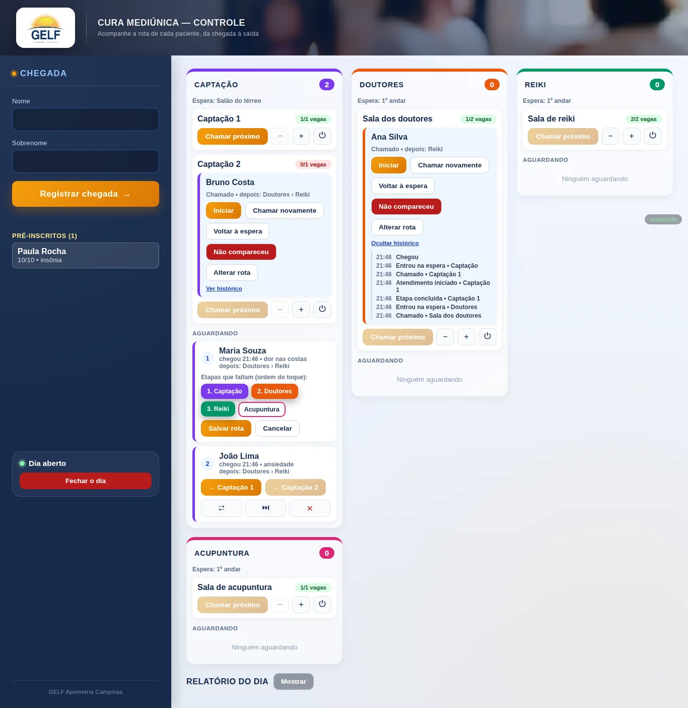

### 7. Não compareceu e voltar à espera
**Não compareceu** encerra o paciente: ele sai da TV e vai para **Finalizados hoje**. Se chegar atrasado,
**Voltar à espera** nesse cartão o devolve ao fim da fila da mesma etapa.

### 8. Ajustes durante o dia
Em cada sala: **−** / **+** tiram ou acrescentam uma vaga (macas); **⏻ / ▶** tira a sala de uso ou a recoloca
("fora de uso"). Uma sala ocupada não pode ser desativada.

### 9. Relatório do dia
Em **Relatório do dia → Mostrar**: chegadas, concluídos, não compareceram, em andamento, tempo médio total e,
por etapa, **atendidos, espera média, duração média e quem aguarda agora**. Não traz nomes.
(Quem é removido do fluxo não conta como chegada.)

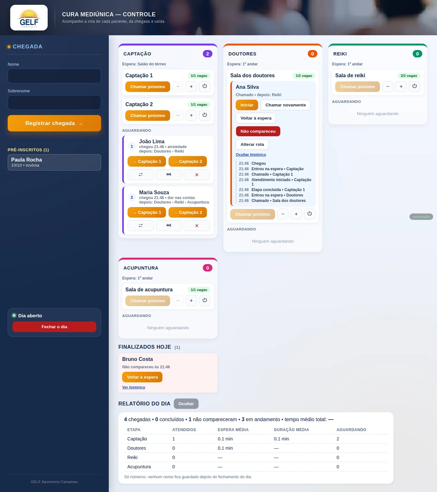

### 10. Fechar o dia
Toque em **Fechar o dia** e confirme em **Confirmar: apagar tudo**. Isso apaga pacientes e pré-inscritos; só o
relatório, **sem nomes**, fica salvo em `dados/relatorios/bio-AAAA-MM-DD.json`. O painel da TV volta a
**Atendimento encerrado**.

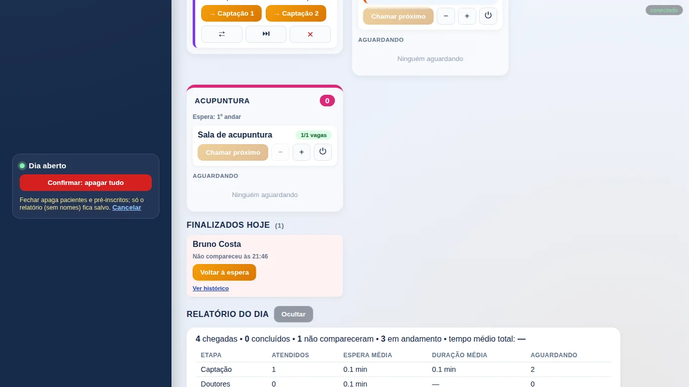

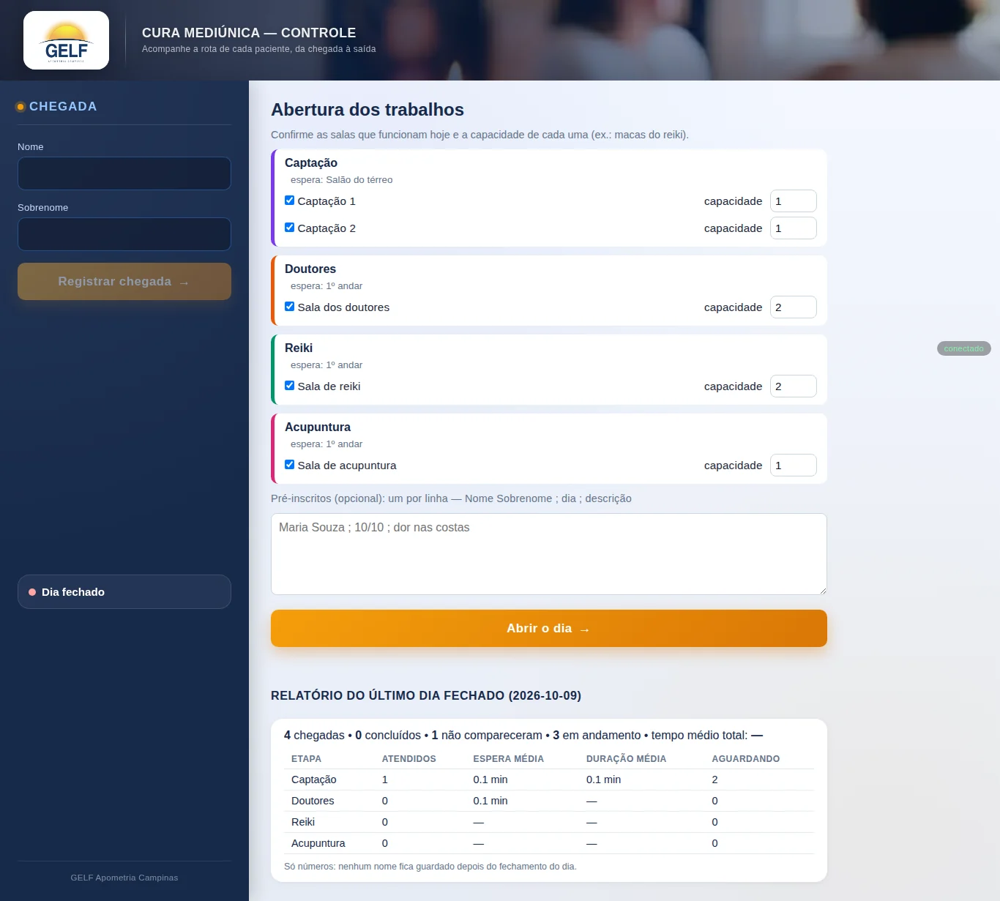

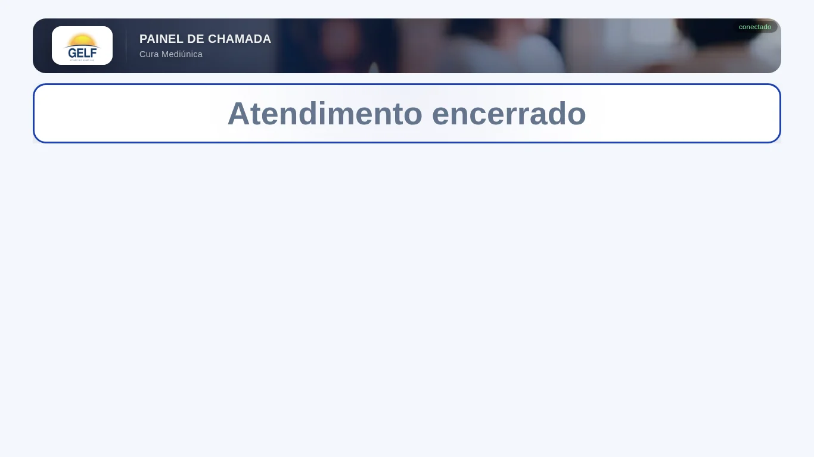

## Transições de um paciente

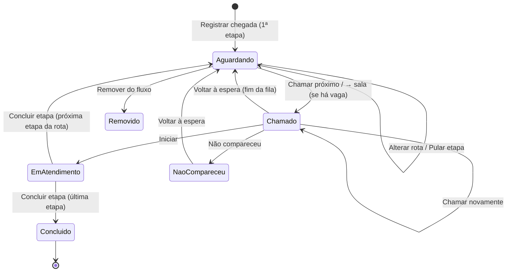
```mermaid
stateDiagram-v2
    [*] --> Aguardando: Registrar chegada (1ª etapa)
    Aguardando --> Chamado: Chamar próximo / → sala (se há vaga)
    Chamado --> Chamado: Chamar novamente
    Chamado --> Aguardando: Voltar à espera (fim da fila)
    Chamado --> EmAtendimento: Iniciar
    Chamado --> NaoCompareceu: Não compareceu
    NaoCompareceu --> Aguardando: Voltar à espera
    EmAtendimento --> Aguardando: Concluir etapa (próxima etapa da rota)
    EmAtendimento --> Concluido: Concluir etapa (última etapa)
    Aguardando --> Aguardando: Alterar rota / Pular etapa
    Aguardando --> Removido: Remover do fluxo
    Concluido --> [*]
```

## Transições de uma sala

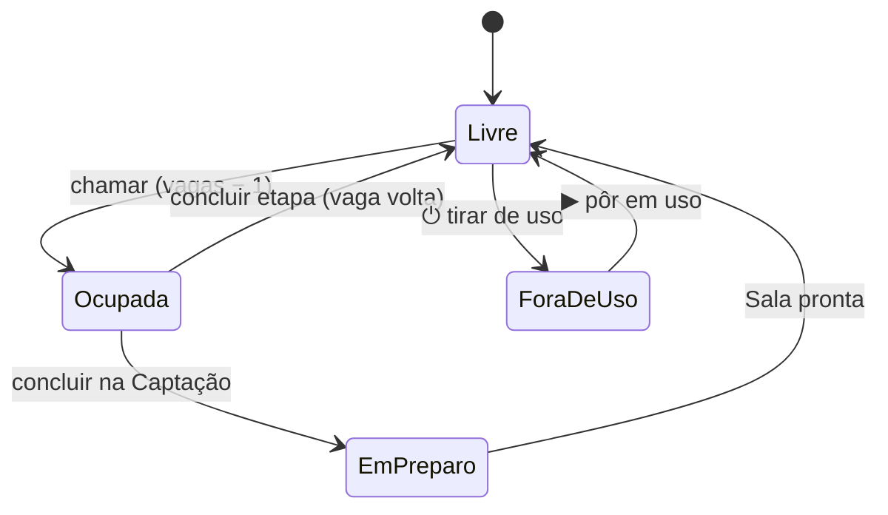
```mermaid
stateDiagram-v2
    [*] --> Livre
    Livre --> Ocupada: chamar (vagas − 1)
    Ocupada --> Livre: concluir etapa (vaga volta)
    Ocupada --> EmPreparo: concluir na Captação
    EmPreparo --> Livre: Sala pronta
    Livre --> ForaDeUso: ⏻ tirar de uso
    ForaDeUso --> Livre: ▶ pôr em uso
```

## Pendências conhecidas
- Função e capacidade da **5ª sala** ainda a confirmar com a equipe.
- Tela de sala para celular (a sala, como o reiki, avisaria pelo celular que está pronta) e orientações
  pós-atendimento do roteiro: fases seguintes.
- Som e ajuste à TV Samsung 32" ainda precisam ser conferidos no equipamento real.

Anterior: [Fluxo 4 — Painel](4-painel.md)
